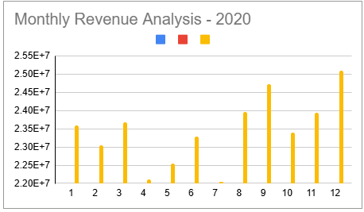
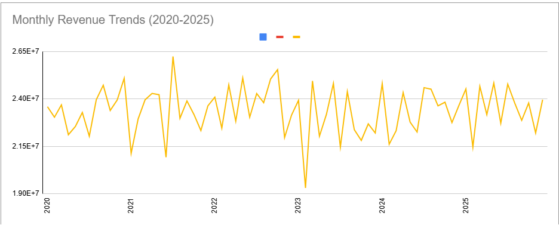
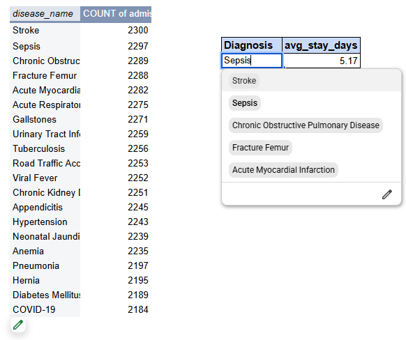

# 🏥 Healthcare Analytics with Google Sheets

## 📋 Project Overview
This project analyzes **45,000+ hospital admissions** using **Google Sheets**. It demonstrates my ability to clean, transform, analyze, and visualize healthcare data — all skills directly applicable to data analyst roles.

**Dataset:** [Hospital HMIS Dataset for Healthcare Analytics](https://www.kaggle.com/datasets/shalakagangurde/hospital-hmis-dataset-for-healthcare-analytics) (Kaggle)

---

## 🛠️ Skills Demonstrated

| Skill | Application |
|-------|-------------|
| **Data Cleaning** | Detected and corrected errors in `patient_payable_amount` |
| **Lookups & Merging** | Used `VLOOKUP` to combine 4 source tables into a single `master` table |
| **Date Functions** | Extracted `YEAR` and `MONTH` for time-series analysis |
| **Pivot Tables** | Created interactive summaries of revenue by month/year |
| **Dynamic Formulas** | Used `AVERAGEIF`, `IFERROR`, `FILTER` to analyze Length of Stay (LOS) |
| **Data Visualization** | Built line charts and bar charts to communicate insights |
| **Interactivity** | Added dropdown selectors for dynamic analysis |

---

## 📊 Key Analyses

### 1. Monthly Revenue Analysis (2020)

- **Peak revenue month:** December
- **Lowest revenue month:** July
- **Average monthly revenue:** ~$23.5M

### 2. Revenue Trends (2020–2025)

- Line chart showing year-over-year revenue progression
- Identified growth patterns and seasonal fluctuations

### 3. Top Diagnoses & Average Length of Stay (LOS)

| Diagnosis | Admissions | Avg. Length of Stay (days) |
|-----------|------------|----------------------------|
| Stroke | 2,300 | 5.17 |
| Sepsis | 2,297 | 5.02 |
| COPD | 2,288 | 4.89 |

**Formula used for dynamic LOS:=IFERROR(AVERAGEIF(Master!L:L, D4, Master!T:T), "N/A")**

---

## 🔍 Data Quality Note
During the project, I identified a data inconsistency: the original `patient_payable_amount` column contained illogical values (patients paying more than the total bill). I corrected this by calculating it as `total_amount - insurance_covered_amount` — a real-world example of data cleaning.

---

## 🧰 Tools Used
- **Google Sheets** (primary analysis tool)
- **Kaggle** (data source)
- **GitHub** (portfolio hosting)

---

## 📬 Contact
**Miriam** – [Email](mailto:miriam.gp1000@gmail.com) | [LinkedIn](https://linkedin.com/in/miriam-gonzalez-a8793a381)

---

*This project is part of my transition from nursing to data analytics.*
